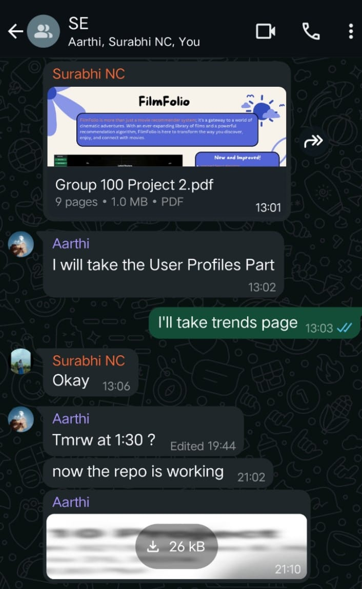

# <i> FilmFolio📽️: Your Destination for Movie Recommendations </i>
# FilmFolio

Welcome to **FilmFolio**, your ultimate movie cataloging tool! FilmFolio helps you organize, track, and explore movies you love.

[](https://github.com/Fall-2024-SE-Group/FilmFolio/issues)
[](https://github.com/Fall-2024-SE-Group/FilmFolio/releases)
[](https://doi.org/10.5281/zenodo.14219412)
[](https://github.com/Fall-2024-SE-Group/FilmFolio/issues?q=is%3Aissue+is%3Aclosed)
[](https://github.com/Fall-2024-SE-Group/FilmFolio/pulls)
[](https://github.com/Fall-2024-SE-Group/FilmFolio/pulls?q=is%3Apr+is%3Aclosed)
[](https://github.com/Fall-2024-SE-Group/FilmFolio/blob/main/LICENSE)
[](https://www.pylint.org/)
[](https://github.com/psf/black)
[](https://github.com/PyCQA/pylint)
[](https://github.com/Fall-2024-SE-Group/FilmFolio/actions/workflows/flake8.yml)

[](https://github.com/Fall-2024-SE-Group/FilmFolio/graphs/contributors)
[](https://github.com/Fall-2024-SE-Group/FilmFolio)


  

<b>FilmFolio is more than just a movie recommender system; it's a gateway to a world of cinematic adventures. With an ever-expanding library of films and a powerful recommendation algorithm, FilmFolio is here to transform how you discover, enjoy, and connect with movies.</b>

# Contents  

- [Why use FilmFolio?](#why-use-filmfolio)
- [Project Documentation](#documentation)
- [Project Presentation Videos](#project-presentation-videos)
- [Brief Overview of Project](#project-description)
- [What Docs](#what-docs)
- [TechStack Used for the Development of Project](#tech-stack-used)
- [Steps for Execution](#getting-started)
- [Future Scope](#future-scope)
- [Contribute](#contribute-to-the-project)
- [Team Members](#contributors)
- [Contact](#contact)
- [License](#license)

## Why use FilmFolio?


FilmFolio: Your movie recommender! Input movies, get tailored suggestions, and share via email. Elevate your movie choices effortlessly!

- **Efficient:** Lightning-fast recommendations for movie buffs! 🚀
- **Adaptable:** Tailor the recommendations to your taste.
- **Accessible:** Works across all platforms and shells.
- **Insightful:** Get movie insights at a glance.
- **Comprehensive:** Supports a wide array of user-preferred movies.
- **Simple:** Easy installation and setup – start discovering great movies in no time!"

## Documentation
Checkout for project documentation [here](https://github.com/Fall-2024-SE-Group/FilmFolio/tree/master/docs)

## Project Presentation Videos


## Project Description
FilmFolio is a user-friendly movie recommender that curates a tailored list of 10 movie predictions based on user-provided movie preferences. Users can input their favorite movies, and our algorithm refines recommendations based on feedback—Liked, Disliked, or Yet To Watch. Additionally, FilmFolio offers the convenience of emailing the recommended movies, enhancing the movie-watching experience. For the system architecture and other details, please refer to our documentation [here](https://github.com/Fall-2024-SE-Group/FilmFolio/tree/master/docs)

## What docs
View our documentation outlining each class and function of FilmFolio here
- [Backend](https://github.com/Fall-2024-SE-Group/FilmFolio/blob/master/docs/backend.md)
- [Frontend](https://github.com/Fall-2024-SE-Group/FilmFolio/blob/master/docs/frontend.md)


## Tech stack Used👨‍💻:

<code><a href="https://developer.mozilla.org/en-US/docs/Glossary/HTML5" target="_blank"></a></code>
<code><a href="https://developer.mozilla.org/en-US/docs/Web/CSS" target="_blank"></a></code> <code><a href="https://www.javascript.com/" target="_blank"></a></code>
<code><a href="https://www.jquery.com//" target="_blank"></a></code>
<code><a href="https://getbootstrap.com/" target="_blank"></a></code>
<code><a href="https://flask.palletsprojects.com/en/1.1.x/" target="_blank"></a></code>
<!--<code><a href="https://github.com/" target="_blank"></a></code>
 <code><a href="https://git-scm.com/" target="_blank"></a></code>
<code><a href="https://github.com/" target="_blank"></a></code> -->
<!-- <code><a href="https://code.visualstudio.com/" target="_blank"></a></code>
<code><a href="https://www.python.org/" target="_blank"></a></code>-->
<!-- <code><a href="https://www.python.org/" target="_blank"></a></code>-->
<code><a href="https://www.mysql.com" target="_blank"></a></code>


<p>
 

 
 
 
</p>

## Getting Started

### Step 1: Clone the Repository* - Start by cloning the repository to your local machine. 
  
``` bash
    git clone https://github.com/Fall-2024-SE-Group/FilmFolio.git
```
    
  (OR) Download the .zip file on your local machine from the following link
  
    https://github.com/Fall-2024-SE-Group/FilmFolio/

  
### Step 2:
   Follow the setup instructions in the installation documentation
   
    https://github.com/SE-Group-AR/FilmFolio/wiki
    
    
<b>Finally, start enjoying personalized movie recommendations!</b>

## Future Scope
FilmFolio is a dynamic project with endless possibilities for expansion and enhancement. Here are some exciting avenues for future development:
- Mobile App Launch:
  Develop and release a mobile version for iOS and Android for better accessibility.. 
- AI-Driven Analytics: :
  Integrate analytics for portfolio performance, trends in user engagement, and personalized recommendations. 
- Media Handling:
  Build robust media upload, encoding, and streaming pipelines using FFmpeg or third-party APIs (e.g., AWS MediaConvert). 
- Advanced Recommendation Engine :
  Implement collaborative filtering (e.g., Matrix Factorization) and content-based filtering to recommend movies based on user preferences and viewing history.

## Chat Screenshot

 

## Contribute to the Project!

Please refer to the [CONTRIBUTING.md](https://github.com/Fall-2024-SE-Group/FilmFolio/blob/master/CONTRIBUTING.md) if you want to contribute to the FilmFolio source code. Follow all the guidelines mentioned in the same and raise a pull request, we would love to look at it ❤️❤️!

## Contributors
<table>
  <tr>
    <td><a href="https://github.com/Fall-2024-SE-Group/FilmFolio/">Project 2</a></td>
    <td ><a href="https://github.com/surabhi1914/">Surabhi Nair</a></td>
    <td ><a href="https://github.com/Hasitha257/">Aarthi Hasitha Yepuri</a></td>
    <td ><a href="https://github.com/Sreeja-Nukarapu/">Sreeja Nukarapu</a></td>
  </tr>
</table>

## Contact
In case of any issues, please e-mail your queries to filmfolio30@gmail.com or raise an issue on this repository.<br>
Our team of developers monitors this e-mail address and would be happy to answer any and all questions you have about setup or use of this project!

## Join the FilmFolio Community:

Contribute to the project and help us improve recommendations.
Share your experience and film discoveries with us.
Together, let's make FilmFolio the ultimate movie companion!
FilmFolio is more than just code; it's a passion for cinema, and we invite you to be a part of this exciting journey. Start exploring, sharing, and discovering movies like never before with FilmFolio!
Let's make movie nights extraordinary together!

## License
This project is under the MIT License.
